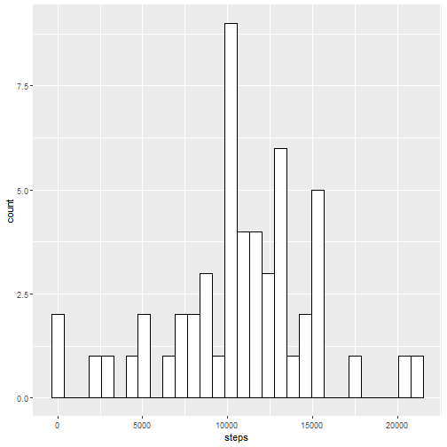
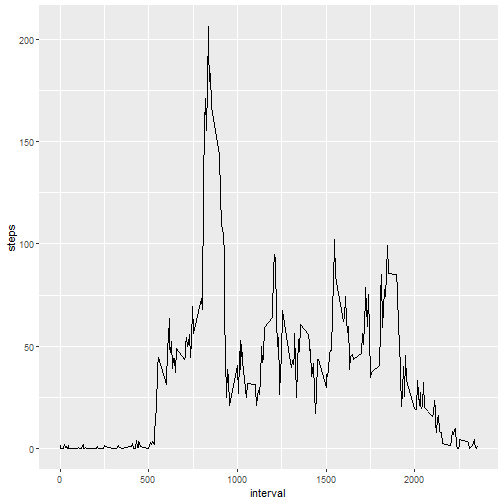
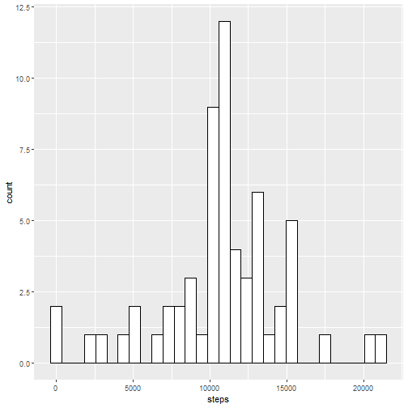

# Activity Monitoring Data


```r
df <- read.csv("activity.csv", sep=",", header = TRUE)
df$date <- as.Date(df$date)
summary(df)
```

```
##      steps             date               interval     
##  Min.   :  0.00   Min.   :2012-10-01   Min.   :   0.0  
##  1st Qu.:  0.00   1st Qu.:2012-10-16   1st Qu.: 588.8  
##  Median :  0.00   Median :2012-10-31   Median :1177.5  
##  Mean   : 37.38   Mean   :2012-10-31   Mean   :1177.5  
##  3rd Qu.: 12.00   3rd Qu.:2012-11-15   3rd Qu.:1766.2  
##  Max.   :806.00   Max.   :2012-11-30   Max.   :2355.0  
##  NA's   :2304
```

```r
str(df)
```

```
## 'data.frame':	17568 obs. of  3 variables:
##  $ steps   : int  NA NA NA NA NA NA NA NA NA NA ...
##  $ date    : Date, format: "2012-10-01" "2012-10-01" "2012-10-01" "2012-10-01" ...
##  $ interval: int  0 5 10 15 20 25 30 35 40 45 ...
```

## 1.Calculating Mean steps taken per day


```r
library(ggplot2)
s <- aggregate(steps ~ date, data=df, sum, rm.na=TRUE)
p <- ggplot(s, aes(x=steps)) + 
  geom_histogram(color="black", fill="white")
p
```

```
## `stat_bin()` using `bins = 30`. Pick better value with `binwidth`.
```


Here, we can calculate mean and median steps of each day

```r
mean(s$steps)
```

```
## [1] 10767.19
```

```r
median(s$steps)
```

```
## [1] 10766
```
Both are almost the same.

## 2. Average Daily Activity Pattern


```r
avgSteps <- aggregate(steps ~ interval, data=df, mean, rm.na=TRUE)
q <- ggplot(data = avgSteps, aes(x=interval, y=steps)) +
  geom_line()
q
```



```r
avgSteps[(which.max(avgSteps$steps)),]
```

```
##     interval    steps
## 104      835 206.1698
```

**835th** Interval has the maximum average number of steps.

## 3. Imputing Missing Values


```r
# Creating a new dataset for imputing NA's
df_imput <- df

# Function for mapping intervals 
fillingNA <- function(interval){
  avgSteps[avgSteps$interval==interval,"steps"]
}
  
for(i in 1:nrow(df_imput)){
  if(is.na(df_imput[i,"steps"])){
    df_imput[i,"steps"] <- fillingNA(df_imput[i,"interval"])
  }
}
head(df_imput)
```

```
##       steps       date interval
## 1 1.7169811 2012-10-01        0
## 2 0.3396226 2012-10-01        5
## 3 0.1320755 2012-10-01       10
## 4 0.1509434 2012-10-01       15
## 5 0.0754717 2012-10-01       20
## 6 2.0943396 2012-10-01       25
```

```r
# Plotting the new dataset with mean steps for each day
s1 <- aggregate(steps ~ date, data=df_imput, sum, rm.na=TRUE)
r <- ggplot(data = s1, aes(x=steps)) +
  geom_histogram(color="black", fill="white")
r
```

```
## `stat_bin()` using `bins = 30`. Pick better value with `binwidth`.
```



```r
# Mean and Median for the imputed dataset
mean(s1$steps)
```

```
## [1] 10767.19
```

```r
median(s1$steps)
```

```
## [1] 10767.19
```
Only value that differ from the missing dataset is the **median**. **Mean** value remains the same.

## 4. Pattern in weekdays and weekends


```r
## Splitting days as Weekday and Weekend
df_imput$weekday <- ifelse(as.POSIXlt(as.Date(df_imput$date))$wday%%6 == 0, "weekend","weekday")
df_imput$weekday <- as.factor(df_imput$weekday)
str(df_imput)
```

```
## 'data.frame':	17568 obs. of  4 variables:
##  $ steps   : num  1.717 0.3396 0.1321 0.1509 0.0755 ...
##  $ date    : Date, format: "2012-10-01" "2012-10-01" "2012-10-01" "2012-10-01" ...
##  $ interval: int  0 5 10 15 20 25 30 35 40 45 ...
##  $ weekday : Factor w/ 2 levels "weekday","weekend": 1 1 1 1 1 1 1 1 1 1 ...
```

```r
## Plotting activity weekdays vs weekends
avgSteps1 <- aggregate(steps ~ interval + weekday, data=df_imput, mean)

t <- ggplot(data = avgSteps1, aes(x=interval, y=steps)) +
  geom_line() + facet_grid(weekday ~ .)
t
```


During weekdays, the average number of steps has reached upto 225 whereas durng weekends it doesn't exceed 175.
